# CodeTimeTracker Database Documentation

## Summary
- [Introduction](#introduction)
- [Database Type](#database-type)
- [Table Structure](#table-structure)
  - [Users](#users)
  - [Activities](#activities)
  - [UserPreferences](#user-preferences)
  - [Tags](#tags)
  - [ActivitiesTags](#activities-tags)
  - [Sprints](#sprints)
  - [TagsSprints](#tags-sprints)
  - [Companies](#companies)
- [Relationships](#relationships)
- [Database Diagram](#database-Diagram)

## Introduction

This document outlines the database schema for the CodeTimeTracker project, a system designed to track coding activities and preferences for users. The database is structured to store user information, preferences, activities, tags associated with these activities, companies, sprints, and the relationships between tags and sprints.

## Database Type

- **Database System:** Microsoft SQL Server (MSSQL)

## Table Structure

### Users

Stores information about the users of the CodeTimeTracker application.

- **UserID** (int, PK): A unique identifier for each user.
- **Username** (varchar(255), not null): The user's chosen username.
- **Email** (varchar(255), not null, unique): The user's email address. It must be unique.
- **Active** (bit, not null, default: 1): Indicates if the user is active.
- **CreatedAt** (datetime, not null, default: 'GETDATE()'): The date and time when the record was created.
- **CreatedBy** (int): The ID of the user who created the record. References `UserID` from the `Users` table.
- **UpdateAt** (datetime): The date and time when the record was last updated.
- **UpdatedBy** (int): The ID of the user who last updated the record. References `UserID` from the `Users` table.
- **DeletedAt** (datetime): The date and time when the record was marked as deleted.
- **DeletedBy** (int): References `UserID` from the `Users` table.

### Activities

Records activities done by users.

- **ActivityID** (int, PK): A unique identifier for each activity.
- **UserID** (int): The ID of the user who performed the activity. References `UserID` from the `Users` table.
- **ActivityDate** (date, not null): The date of the activity.
- **StartTime** (time): When the activity started.
- **EndTime** (time): When the activity ended.
- **Description** (TEXT): A text description of the activity.
- **Active** (bit, not null, default: 1): Indicates if the activity is active.
- **CreatedAt** (datetime, not null, default: 'GETDATE()'): The date and time when the record was created.
- **CreatedBy** (int): The ID of the user who created the record. References `UserID` from the `Users` table.
- **UpdateAt** (datetime): The date and time when the record was last updated.
- **UpdatedBy** (int): The ID of the user who last updated the record. References `UserID` from the `Users` table.
- **DeletedAt** (datetime): The date and time when the record was marked as deleted.
- **DeletedBy** (int): References `UserID` from the `Users` table.

### UserPreferences

This table allows storing various preferences for each user as key-value pairs.

- **UserPreferenceID** (int, PK): A unique identifier for each user preference.
- **UserID** (int): Links to the UserID in the Users table. References `UserID` from the `Users` table.
- **PreferenceType** (varchar(255), not null): Type of preference (e.g., notification settings, theme).
- **PreferenceValue** (varchar(255), not null): The value of the specified preference.
- **Active** (bit, not null, default: 1): Indicates if the user preference is active.
- **CreatedAt** (datetime, not null, default: 'GETDATE()'): The date and time when the record was created.
- **CreatedBy** (int): The ID of the user who created the record. References `UserID` from the `Users` table.
- **UpdateAt** (datetime): The date and time when the record was last updated.
- **UpdatedBy** (int): The ID of the user who last updated the record. References `UserID` from the `Users` table.
- **DeletedAt** (datetime): The date and time when the record was marked as deleted.
- **DeletedBy** (int): References `UserID` from the `Users` table.

### Tags

Manages tags that can be assigned to activities.

- **TagID** (int, PK): A unique identifier for each tag.
- **CompanyID** (int): Links to the CompanyID in the Companies table. Identifies which company the tag belongs to.
- **TagName** (varchar(255), unique): The name of the tag.
- **Active** (bit, not null, default: 1): Indicates if the tag is active.
- **CreatedAt** (datetime, not null, default: 'GETDATE()'): The date and time when the record was created.
- **CreatedBy** (int): The ID of the user who created the record. References `UserID` from the `Users` table.
- **UpdateAt** (datetime): The date and time when the record was last updated.
- **UpdatedBy** (int): The ID of the user who last updated the record. References `UserID` from the `Users` table.
- **DeletedAt** (datetime): The date and time when the record was marked as deleted.
- **DeletedBy** (int): References `UserID` from the `Users` table.

### ActivitiesTags

A junction table for many-to-many relationships between activities and tags.

- **ActivityID** (int, PK): Links to the ActivityID in the Activities table.
- **TagID** (int, PK): Links to the TagID in the Tags table.
- **Active** (bit, not null, default: 1): Indicates if the relationship is active.
- **CreatedAt** (datetime, not null, default: 'GETDATE()'): The date and time when the record was created.
- **CreatedBy** (int): The ID of the user who created the record. References `UserID` from the `Users` table.
- **UpdateAt** (datetime): The date and time when the record was last updated.
- **UpdatedBy** (int): The ID of the user who last updated the record. References `UserID` from the `Users` table.
- **DeletedAt** (datetime): The date and time when the record was marked as deleted.
- **DeletedBy** (int): References `UserID` from the `Users` table.

### Sprints

Stores information about sprints.

- **SprintID** (int, PK): A unique identifier for each sprint.
- **CompanyID** (int): Links to the CompanyID in the Companies table. Identifies which company the sprint belongs to.
- **Name** (varchar(255), not null): Name of the sprint.
- **SprintNumber** (int): The number of the sprint.
- **StartDate** (date, not null): The starting date of the sprint.
- **EndDate** (date, not null): The ending date of the sprint.
- **Description** (TEXT): A text description of the sprint.
- **Active** (bit, not null, default: 1): Indicates if the sprint is active.
- **CreatedAt** (datetime, not null, default: 'GETDATE()'): The date and time when the record was created.
- **CreatedBy** (int): The ID of the user who created the record. References `UserID` from the `Users` table.
- **UpdateAt** (datetime): The date and time when the record was last updated.
- **UpdatedBy** (int): The ID of the user who last updated the record. References `UserID` from the `Users` table.
- **DeletedAt** (datetime): The date and time when the record was marked as deleted.
- **DeletedBy** (int): References `UserID` from the `Users` table.

### TagsSprints

Connects tags with sprints.

- **TagID** (int, PK): Links to the TagID in the Tags table.
- **SprintID** (int, PK): Links to the SprintID in the Sprints table.
- **Active** (bit, not null, default: 1): Indicates if the relationship is active.
- **CreatedAt** (datetime, not null, default: 'GETDATE()'): The date and time when the record was created.
- **CreatedBy** (int): The ID of the user who created the record. References `UserID` from the `Users` table.
- **UpdateAt** (datetime): The date and time when the record was last updated.
- **UpdatedBy** (int): The ID of the user who last updated the record. References `UserID` from the `Users` table.
- **DeletedAt** (datetime): The date and time when the record was marked as deleted.
- **DeletedBy** (int): References `UserID` from the `Users` table.

### Companies

Stores information about companies involved in the sprints.

- **CompanyID** (int, PK): A unique identifier for each company.
- **CompanyName** (varchar(255), unique): The name of the company.
- **CreatedAt** (datetime, not null): The date and time when the company record was created.
- **CreatedBy** (int, not null): The ID of the user who created the company record.
- **UpdatedAt** (datetime): The date and time when the company record was last updated.
- **UpdatedBy** (int): The ID of the user who last updated the company record.
- **DeletedAt** (datetime): The date and time when the company record was marked as deleted. Optional for logical deletion.
- **DeletedBy** (int): The ID of the user who marked the company record as deleted. Optional for logical deletion.

## Relationships

- **Users to UserPreferences**: One-to-Many (A user can have multiple preferences).
- **Users to Activities**: One-to-Many (A user can perform multiple activities).
- **Activities to Tags**: Many-to-Many (An activity can have multiple tags, and a tag can be associated with multiple activities).
- **Sprints to Tags**: Many-to-Many (A sprint can have multiple tags, and a tag can be associated with multiple sprints).

## Database Diagram

```mermaid
erDiagram
    
    Users {
        int UserID PK "A unique identifier for each user."
        varchar Username "The user's chosen username."
        varchar Email "The user's email address. It must be unique."
        bit Active "Indicates if the user is active."
        datetime CreatedAt "The date and time when the record was created."
        int CreatedBy "The ID of the user who created the record."
        datetime UpdateAt "The date and time when the record was last updated."
        int UpdatedBy "The ID of the user who last updated the record."
        datetime DeletedAt "The date and time when the record was marked as deleted."
        int DeletedBy "References UserID from the Users table."
    }

    UserPreferences {
        int UserPreferenceID PK "A unique identifier for each user preference."
        int UserID FK "Links to the UserID in the Users table."
        varchar PreferenceType "Type of preference."
        varchar PreferenceValue "The value of the specified preference."
        bit Active "Indicates if the preference is active."
        datetime CreatedAt "The date and time when the record was created."
        int CreatedBy "The ID of the user who created the record."
        datetime UpdateAt "The date and time when the record was last updated."
        int UpdatedBy "The ID of the user who last updated the record."
        datetime DeletedAt "The date and time when the record was marked as deleted."
        int DeletedBy "References UserID from the Users table."
    }

    Activities {
        int ActivityID PK "A unique identifier for each activity."
        int UserID FK "The ID of the user who performed the activity."
        date ActivityDate "The date of the activity."
        time StartTime "When the activity started."
        time EndTime "When the activity ended."
        TEXT Description "A text description of the activity."
        bit Active "Indicates if the activity is active."
        datetime CreatedAt "The date and time when the record was created."
        int CreatedBy "The ID of the user who created the record."
        datetime UpdateAt "The date and time when the record was last updated."
        int UpdatedBy "The ID of the user who last updated the record."
        datetime DeletedAt "The date and time when the record was marked as deleted."
        int DeletedBy "References UserID from the Users table."
    }

    Tags {
        int TagID PK "A unique identifier for each tag."
        int CompanyID FK "Links to the CompanyID in the Companies table."
        varchar TagName "The name of the tag."
        bit Active "Indicates if the tag is active."
        datetime CreatedAt "The date and time when the record was created."
        int CreatedBy "The ID of the user who created the record."
        datetime UpdateAt "The date and time when the record was last updated."
        int UpdatedBy "The ID of the user who last updated the record."
        datetime DeletedAt "The date and time when the record was marked as deleted."
        int DeletedBy "References UserID from the Users table."
    }

    ActivitiesTags {
        int ActivityID PK, FK "Links to the ActivityID in the Activities table."
        int TagID PK, FK "Links to the TagID in the Tags table."
    }

    Sprints {
        int SprintID PK "A unique identifier for each sprint."
        int CompanyID FK "Links to the CompanyID in the Companies table."
        varchar Name "Name of the sprint"
        int SprintNumber "The number of the sprint"
        date StartDate "The starting date of the sprint."
        date EndDate "The ending date of the sprint."
        TEXT Description "A text description of the sprint."
        bit Active "Indicates if the sprint is active."
        datetime CreatedAt "The date and time when the record was created."
        int CreatedBy "The ID of the user who created the record."
        datetime UpdateAt "The date and time when the record was last updated."
        int UpdatedBy "The ID of the user who last updated the record."
        datetime DeletedAt "The date and time when the record was marked as deleted."
        int DeletedBy "References UserID from the Users table."
    }

    TagsSprints {
        int TagID PK, FK "Links to the TagID in the Tags table."
        int SprintID PK, FK "Links to the SprintID in the Sprints table."
    }

    Companies {
        int CompanyID PK "A unique identifier for each company."
        varchar CompanyName "The name of the company."
        datetime CreatedAt "The date and time when the company record was created."
        int CreatedBy "The ID of the user who created the company record."
        datetime UpdatedAt "The date and time when the company record was last updated."
        int UpdatedBy "The ID of the user who last updated the company record."
        datetime DeletedAt "The date and time when the company record was marked as deleted."
        int DeletedBy "The ID of the user who marked the company record as deleted."
    }

    Users ||--o{ UserPreferences : ""
    Users ||--o{ Activities : ""
    Activities ||--|| ActivitiesTags : ""
    Tags ||--|| ActivitiesTags : ""
    Tags ||--|| TagsSprints : ""
    Sprints ||--|| TagsSprints : ""
    Companies ||--o{ Tags : ""
    Companies ||--o{ Sprints : ""
```

